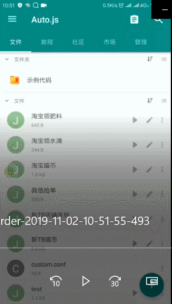

# 淘宝脚本
欢迎反馈脚本使用问题，兼容安卓6.0
## 淘宝喵币
#### 主要功能  
自动点按式完成淘宝喵币收集，第三方工具 [Autojs](apk)
#### 主要流程信息
* [查看流程信息](./custom/log.txt)
#### 重要更新
##### 11.02 更新 [直达更新](./release/淘宝喵币2.1.js)
1. 修复任务完成不跳转
2. 修正提示信息准确性
3. 更加灵活，[组件定制](./custom)
##### 历史版本
* [淘宝喵币0.1](./release/history/淘宝喵币0.1.js)  
  1. 坐标点击版本
* [淘宝喵币1.0](./release/history/淘宝喵币1.0.js)
  1. 升级组件点击版本
* [淘宝喵币1.1](./release/history/淘宝喵币1.1.js)
  1. 更友好的提示信息
  2. 增加浏览店铺签到功能
* [淘宝喵币1.2](./release/history/淘宝喵币1.2.js)
  1. 更友好温馨提示通知
  2. 修正淘宝组件更新
  3. 增加任务最大极限时间
* [淘宝喵币1.3](./release/history/淘宝喵币1.3.js)
  1. 多线程统计时间
  2. 超时提醒手动操作
  3. 更细致化提醒
* [淘宝喵币2.0](./release/history/淘宝喵币2.0.js)
  1. 增加[定制组件](./custom)信息
  2. 修正提示信息准确性
  3. 操作[流程信息](./custom/log.txt)
#### 使用教程
1. 安装软件 [Autojs](apk)  
Autojs是一款安卓脚本自动化模拟用户点按操作apk
2. 导入js  
下载 [js](release) 脚本导入到Autojs中，点击运行即可。
3. 脚本效果   

## 温馨提示
1. 使用过程中有一定的延时，可自行调整 <kdb> sleep() </kbd> 参数
2. 操作均由脚本自动跳转设置，勿自行切换页面
3. 如果页面长时间未反应，可自行进入活动页
4. 操作完成后会有提示，如果有提示未进行任务则不兼容
### 期待更多